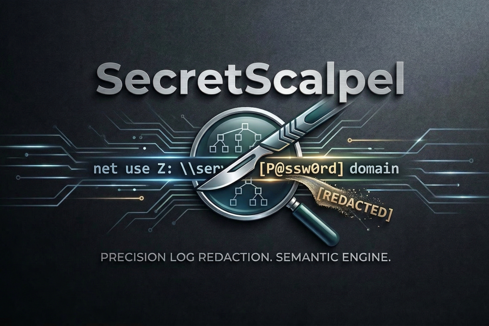

# SecretScalpel

<p align="center"></p>

A log redaction tool that strips credentials from command-line strings by understanding command structure rather than pattern matching.

## The Problem

When you're shipping customer logs to a SIEM or SOAR, command-line strings come with them — `psexec`, `net use`, `sqlcmd`, connection strings. Those commands often contain passwords in plaintext.

The obvious approach is regex. The problem is that commands like `psexec -u admin -p SuperSecret! cmd.exe` don't have a reliable pattern you can regex for. `-p` means password there but means something else in a hundred other tools. You end up writing one rule for `psexec -p`, another for `psexec -p` with a host argument, another for `psexec64`, another for the attached form `-pPassword`. The rules compound, they interact in unpredictable ways, and a pattern broad enough to catch everything ends up firing on things it shouldn't.

## How SecretScalpel Solves It

Instead of pattern matching on the content of tokens, it matches on their position. You define what a command looks like:

```json
{ "phrase": ["psexec", "-u", "<any>", "-p", "<REDACT>"] }
```

That rule says: when you see `psexec`, followed by `-u`, followed by anything, followed by `-p`, the next token is a password — redact it. The password doesn't need to look like a password. Its position in the command is what identifies it.

This has a few practical advantages over a regex pipeline:

- **Rules don't compound.** `<any>` absorbs optional tokens naturally, so one rule covers the variations that would otherwise need a dozen regex patterns.
- **It doesn't over-redact.** The full command structure has to match. `psexec` has to actually be there.
- **Overlap is explicit.** When two rules match the same region, priority determines which wins. No ambiguity.
- **Coverage gaps are visible.** A missing rule means adding one JSON entry and one test case. You know exactly what's covered.

For patterns where position genuinely doesn't work — URL basic auth, connection strings, formats with no reliable token anchor — there's a regex fallback. Those rules are small in number, explicitly marked, and guarded so they only run when a required character is present in the line. The goal is to keep the regex surface auditable rather than letting it grow into the thing you were trying to avoid.

```bash
$ echo 'psexec -u admin -p SuperSecret! cmd.exe' | secretscalpel
psexec -u admin -p ************ cmd.exe

$ echo 'net use Z: \\server P@ssword domain' | secretscalpel
net use Z: \\server ******** domain

$ echo '{"cmd": "net use Z: \\\\server P@ssword domain"}' | secretscalpel
{"cmd": "net use Z: \\\\server ******** domain"}
```

## Where It's Used

Anywhere logs pass through before reaching a destination you don't fully control — a SOAR platform, a ticketing system, a customer-facing portal, a third-party SIEM. It reads from stdin and writes to stdout, so it fits into a Fluent Bit pipeline, a Lambda function, or any shell pipe without modification.

## Installation

```bash
go install github.com/mtallan/SecretScalpel@latest
```

Or build from source:

```bash
git clone https://github.com/mtallan/SecretScalpel
cd SecretScalpel
go build -o secretscalpel .
```

## Usage

```bash
# Pipe logs through
cat app.log | secretscalpel

# Show which rule matched each redaction
echo 'psexec -u admin -p SuperSecret! cmd.exe' | secretscalpel -debug-rules

# Custom mask string
cat app.log | secretscalpel -mask '[REDACTED]'

# Write a JSON stats report to stderr on exit (rules fired, bytes/lines processed)
cat app.log | secretscalpel -stats 2>report.json

# Use a custom rules directory
cat app.log | secretscalpel -rules /etc/secretscalpel/rules

# Validate rule files (useful in CI)
secretscalpel -validate-rules

# Health check — loads rules, prints OK, exits 0
secretscalpel -health
```

**Flags:**

| Flag | Default | Description |
|------|---------|-------------|
| `-rules` | `./rules` | Path to rules directory |
| `-mask` | `*` | Redaction mask character(s) |
| `-debug-rules` | `false` | Replace redacted values with `[RULE-ID]` to identify which rule matched |
| `-stats` | `false` | Write a JSON redaction summary to stderr on exit |
| `-validate-rules` | — | Validate rule files and exit |
| `-health` | — | Load rules, print OK, exit 0 |
| `-version` | — | Print version and exit |

## Rules

Rules live in `rules/*.json` and are loaded at startup. No recompilation required.

**Trie rules** — token sequence matching:
```json
{
  "id": "WIN-PSEXEC-SEPARATED",
  "phrase": ["psexec", "-u", "<any>", "-p", "<REDACT>"],
  "priority": 0,
  "enabled": true,
  "min_length": 4
}
```

Phrase tokens:
- Literal — matches exactly (case-insensitive)
- `<REDACT>` — matches any token, redacts it
- `<any>` — matches any token, leaves it
- `<any:pattern>` — matches tokens whose text matches the regex
- `<redact:pattern>` — matches and redacts tokens matching the regex

**Regex rules** — for patterns that can't be expressed as token sequences:
```json
{
  "id": "PHASE0-URI-BASIC-AUTH",
  "phrase": ["(?i)https?://[^\\s:]+:([^\\s@:]+)@[^\\s/]+"],
  "isRegex": true,
  "required_byte": "@",
  "priority": 4,
  "enabled": true
}
```

`required_byte` skips the regex entirely if that byte isn't present in the input line.

**JSON key rules** — fully redact values under specific keys regardless of content:
```json
{
  "id": "JSON-KEY-SENTINELS",
  "type": "json_key",
  "phrase": ["password", "secret", "token", "api_key"],
  "enabled": true
}
```

Other rule fields: `mask` (per-rule mask override), `redact_after` (redact only after a delimiter within a token), `min_length`/`max_length` (skip redaction if the captured value is outside this length range).

## Included Rules

121 rules across Windows, Linux, macOS, cloud CLIs, and third-party tools:

- **Windows:** `psexec`, `net use`, `cmdkey`, `runas`, `schtasks`, `sqlcmd`, `wmic`, `mstsc`, `rasdial`, PowerShell credential patterns, Mimikatz output
- **Linux:** `mysql`, `psql`, `curl`, `openssl`, `ssh-keygen`, `docker login`, `ansible-vault`
- **Cloud:** AWS CLI, `gcloud`, `az` keyvault, Kubernetes/Helm
- **Third-party:** Impacket, SQLPlus, SVN, `git clone` with embedded credentials
- **Generic:** JWT tokens, PEM private keys, AWS access key IDs, bearer tokens, URL basic auth, database connection strings

## Stats & Compliance Reporting

The `-stats` flag writes a JSON summary to stderr when the process exits:

```json
{
  "session_start": "2026-04-04T20:10:59Z",
  "session_end": "2026-04-04T20:10:59Z",
  "duration_ms": 43,
  "bytes_processed": 524288,
  "lines_processed": 4821,
  "total_matches": 12,
  "rule_hits": {
    "WIN-PSEXEC-NOHOST": 8,
    "NET-USE-DRIVE-PASS": 4
  }
}
```

Only rules that actually fired appear in `rule_hits`. The redacted log output goes to stdout as normal, so the two streams can be separated:

```bash
cat app.log | secretscalpel -stats 2>report.json | gzip > redacted.log.gz
```

**Important:** stats are per-invocation, not cumulative. Each time the binary runs it starts from zero. If your shipper calls SecretScalpel once per batch, you get one JSON blob per batch. Aggregating those into daily totals — summing `rule_hits` across invocations — is the job of whatever is collecting your stderr output (CloudWatch Logs, Splunk, Elastic, etc.). The query depends on your stack, but the data is there if stderr is being captured.

The per-rule counts are the most actionable signal. A spike in `WIN-PSEXEC-NOHOST` means credentials are appearing in logs from psexec activity — that's worth knowing independently of the redaction itself.

## As a Library

```go
import "github.com/mtallan/SecretScalpel/redactor"

trie := redactor.NewTrie("*", 0, 0)
redactor.LoadRulesFromDir("./rules", trie)

// Redact a raw line
var buf bytes.Buffer
redactor.RedactBytesToWriter(&buf, []byte(line), trie)

// Redact a JSON line
redacted := redactor.RedactAllJSONStrings([]byte(jsonLine), trie)

// Stream processing
err := redactor.ProcessStream(os.Stdin, os.Stdout, trie, 0) // 0 = NumCPU

// Stats snapshot after processing
stats := trie.Stats()
```

## Architecture

```
Input stream
     │
     ▼
ProcessStream (orchestrator)
     │ chunks input into 256KB batches, fans out to worker pool
     ▼
Per-line auto-detect
     │
     ├── JSON line  → RedactAllJSONStrings
     │                walks string values, redacts in-place
     │
     └── Raw line   → RedactBytesToWriter
                      │
                      ├── Phase 0: Regex rules
                      │   skipped entirely if required_byte absent from line
                      │
                      └── Phase 1: Trie engine
                          tokenize → sliding window → match phrases
                          sort by priority → resolve overlaps → apply masks
```

Lines exceeding 1MB are dropped with a warning. The engine workspace is pooled to avoid per-line allocations.

## Limitations

SecretScalpel only redacts patterns covered by loaded rules. If a credential format doesn't have a rule, it passes through unmodified. It is not a DLP system and does not replace network-level controls.

Test your rules against your actual log data before deploying.

## Contributing

Rule contributions are the most valuable kind. See CONTRIBUTING.md for the rule format, how to add test cases, and how to run the test suite.

## License

MIT
